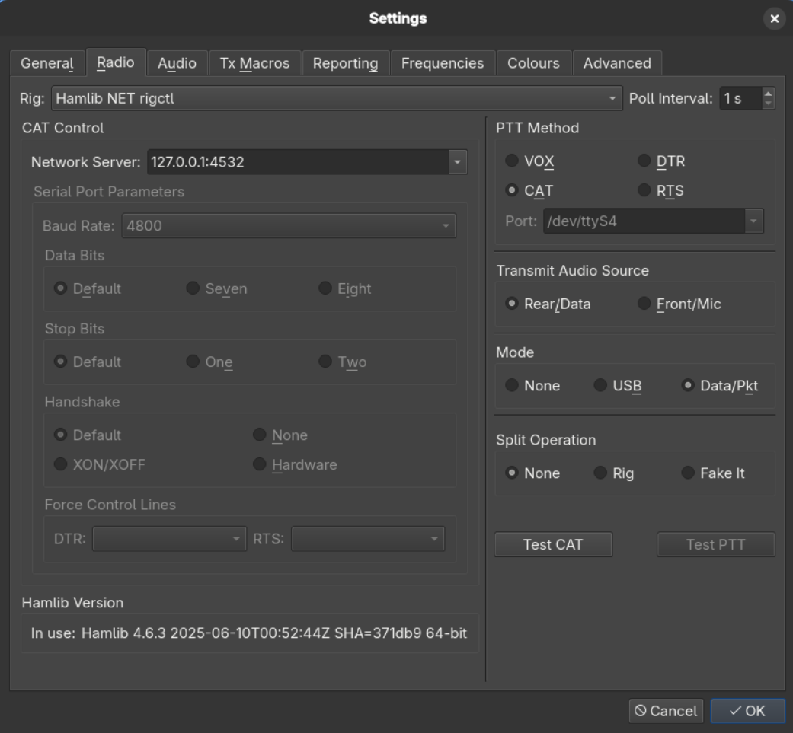

# FT8DC

**FT8 Dataset Creator** is a tool developed for research purposes to automate the creation of an [FT8](https://en.wikipedia.org/wiki/FT8) dataset. Its core functionality can be summarized in the following steps:

1. Listen to an FT8 band for a specified duration using the WSJT-X receiver.
2. Transmit a CQ call on the same frequency.
3. Query PSK Reporter to identify which stations received the CQ message.

## Requirements
1. A radio transceiver that supports CAT (Computer Aided Transceiver) control and uses audio channels for transmission and reception.
2. WSJT-X (version 2.7.0 or later).
3. On Linux systems, you must install rigctld. For example, on Fedora you can directly use the package manager: `dnf install rigctld`

## Installation
1. Clone the repository `git clone https://github.com/miguelboing/ft8dc.git`.
2. Install the required packages `pip install -r requirements.txt`.

## Usage

1. **Connect your computer to the radio** and check if **rigctld** is successfuly installed.
   For more information, see the [Hamlib rigctl/rigctld documentation](https://www.piwebcat.g3vpx.net/84rigctlrigctld-documentation.html).

   > **Note for Windows users:**  
   > You can use the WSJT-X `rigctld` version. For the following steps, use `rigctld-wsjtx` instead of `rigctld`.

   ```bash
   rigctld -h
   ```  

2. **List supported radios** using the command:  
   ```bash
   rigctld -l
   ```  
   Find the corresponding Rig number for your radio (e.g., Flex-Radio 64XX is **2036**).

3. **Run the `rigctld` daemon**, passing the Rig number and the communication interface:

   - **Using a serial port:**
     ```bash
     rigctld -m 2036 -s 115200 -r /dev/ttyUSB0
     ```
   - **Using a network socket:**
     ```bash
     rigctld -m 2036 -r 127.0.0.1:5002
     ```

4. **Verify the `rigctld` connection** by reading the radio's frequency:  
   ```bash
   rigctl -m 2 -r 127.0.0.1:4532 f
   ```
   > **Note:** Use `-m 2` and `-r 127.0.0.1:4532` as these are the default interface values created by `rigctld`.

5. **Configure WSJT-X:**

   - Open WSJT-X and go to `Settings -> Radio`
   - Use the configuration shown below:

   

6. **Set program behavior** by editing the `config.toml` file.  
   > Refer to the inline comments in the file for configuration guidance.

7. **Run the main script:**
   ```bash
   python -m ft8dc
   ```

8. **After the program finishes**, collected data will be saved at:  
   ```
   ft8dc/dataset/output/
   ```  
   Each iteration generates a new sample file.

9. **Convert samples to readable formats:**

   - To convert a specific sample:
     ```bash
     python to_readable_format.py ./dataset/output/sample_name.pkl.gz
     ```
     This creates a folder named after the sample and exports the data as `.csv` and `.txt` files.

   - To convert **all samples at once**:
     ```bash
     python to_readable_format.py dataset/output/*
     ```

## Contributing
Coming soon — contributions are welcome! Please check the issues page for current tasks.

## Road Map
Version v0.1 is fully functional, but several components can be improved. Currently, the transmitter is implemented entirely in Python, while the receiver still relies on WSJT-X to capture packets. Future development aims to implement the receiving functionality in Python as well, removing the WSJT-X dependency.

For additional improvements, known issues, and feature requests, please refer to the issues page.

